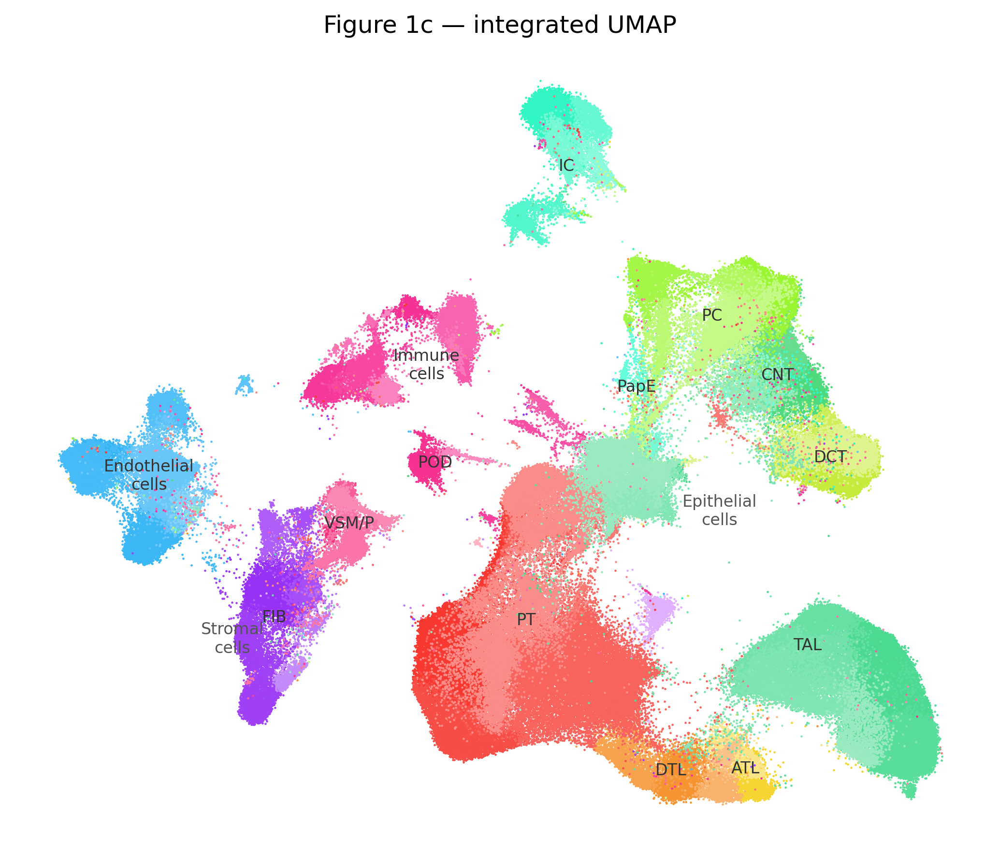
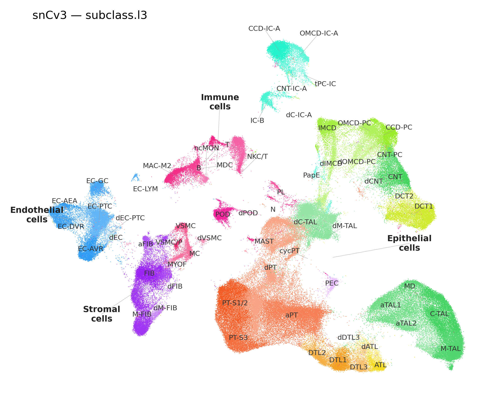
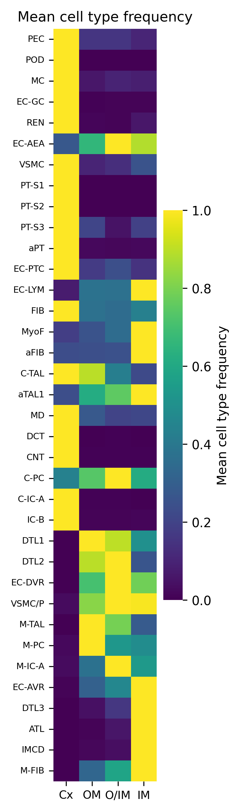
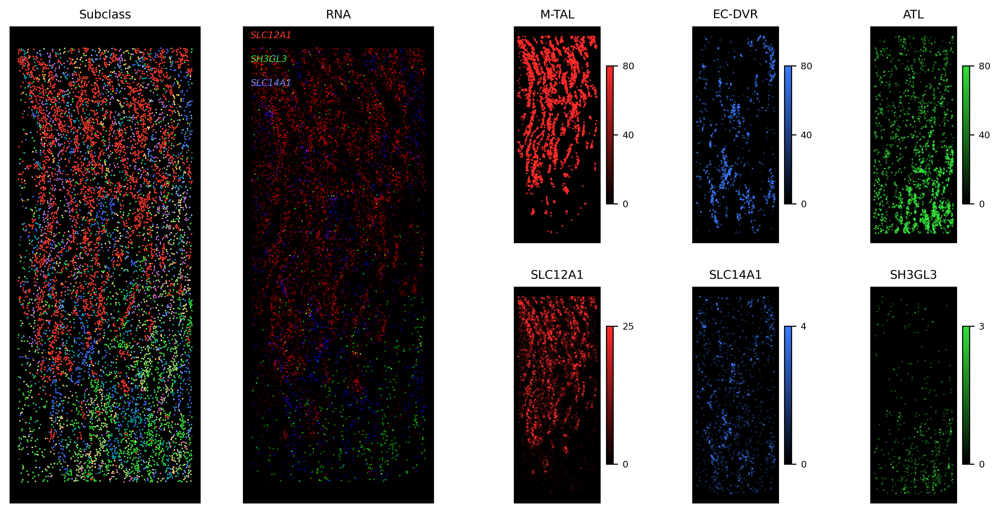
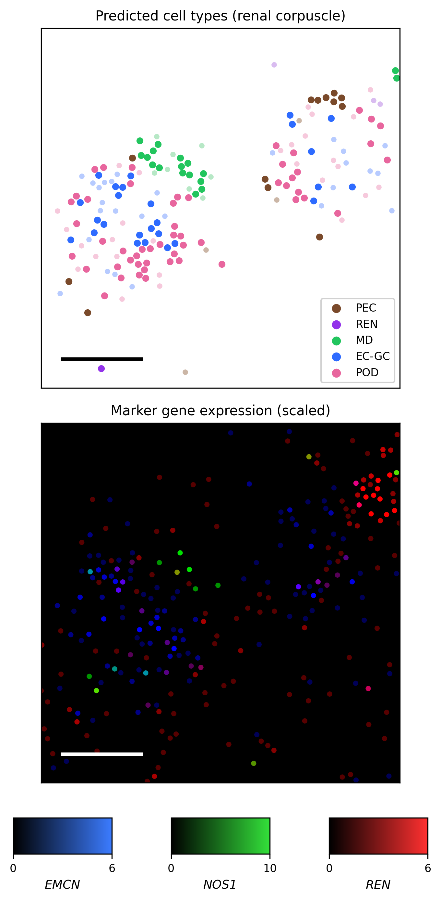
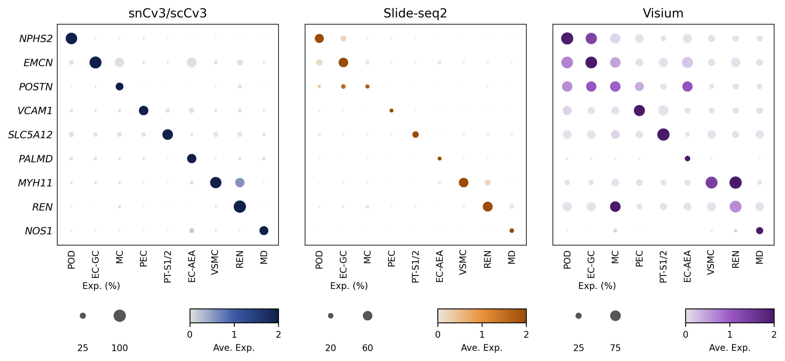
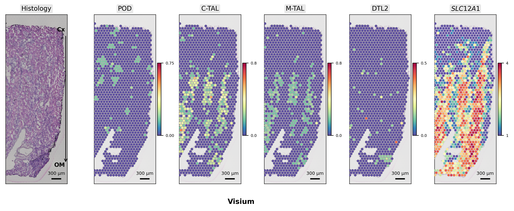
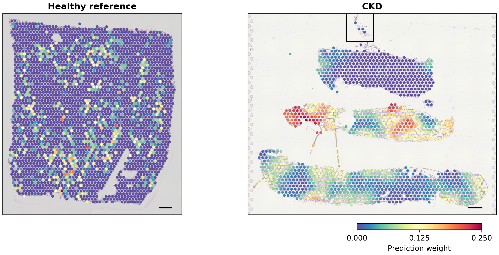

# Human Kidney Cell-State Atlas — Figure Reproduction

Computational reproduction of selected panels from [Lake et al., *Nature* 2023](https://doi.org/10.1038/s41586-023-05769-3) — *An atlas of healthy and injured cell states and niches in the human kidney*.

**Notebook:** [`human_kidney_scrna_atlas_reproduction_Final.ipynb`](human_kidney_scrna_atlas_reproduction_Final.ipynb)  
**Reference code:** [KPMP Cell-State-Atlas-2022](https://github.com/KPMP/Cell-State-Atlas-2022)

[](https://colab.research.google.com/github/Tepeng0213/An-atlas-of-healthy-and-injured-cell-states-and-niches-in-the-human-kidney/blob/main/human_kidney_scrna_atlas_reproduction_Final.ipynb)

---

## 1. Project Core: Problems, Skills, and Tech Stack

### Problems Addressed

- **Multi-modal integration:** How to harmonize single-nucleus RNA-seq (snRNA-seq), single-cell RNA-seq (scRNA-seq), Slide-seq, and Visium spatial transcriptomics into a unified kidney cell-state framework.
- **Cross-platform validation:** Whether cell-type markers and altered injury states are consistent across sequencing technologies.
- **Spatial disease mapping:** How injury-associated cell states (e.g., adaptive epithelial, degenerative) distribute on tissue sections in health vs. chronic kidney disease (CKD).
- **Scalable reproduction:** Re-implementing publication-grade figures with memory-efficient pipelines suitable for standard compute (12–64 GB RAM).

### Core Skills Demonstrated

| Domain | Capabilities |
|--------|----------------|
| **Single-cell / snRNA-seq** | Integrated atlas navigation, modality-aware subsetting, UMAP visualization, KPMP subclass ontology |
| **Spatial transcriptomics** | Visium Space Ranger assembly, H&E co-registration, per-spot label transfer, feature mapping |
| **Slide-seq / spatial arrays** | Giotto object parsing, RCTD deconvolution weights, cortico-medullary axis quantification |
| **Cross-modality statistics** | kNN soft assignment, Seurat TransferData (R), Fisher exact tests, pseudobulk comparisons |
| **Data engineering** | Lightweight `h5py` extraction, parquet caching, GEO bulk download, RunPod volume workflows |

### Tech Stack

**Python:** Scanpy, AnnData, h5py, pandas, NumPy, SciPy, scikit-learn, matplotlib, seaborn, pyarrow, rdata (Giotto RDS)  
**R (selected modules):** Seurat 4/5, TransferData for Visium annotation  
**Infrastructure:** Google Colab, RunPod (CPU/RAM-optimized), Cursor Remote-SSH, `kidney_atlas_paths.py` for path unification  
**Public data:** CZ CELLxGENE integrated kidney atlas, GEO GSE183274 (Slide-seq), GSE183456 (Visium), GSE183277 (snCv3 reference)

---

## 2. Reproduced Figures — Technology, Workflow, and Outputs

### Figure 1c — Integrated UMAP with Cell-Type Annotations

| Item | Detail |
|------|--------|
| **Modality** | Integrated snRNA-seq + scRNA-seq (CELLxGENE release; ~304k cells) |
| **Biological focus** | Global kidney cell-state landscape; KPMP `subclass.l3` / `subclass.l1` hierarchy |
| **Core methods** | Lightweight `h5py` read of `obsm/X_umap` + metadata only (no full expression matrix); pastel palette; on-plot labels for major lineages |
| **Tools** | Scanpy, matplotlib, h5py |
| **Key outputs** | `figure1c_labeled.png`, `figure1c_modalities.png` |

**What this demonstrates:** Efficient handling of large public atlases without loading multi-GB matrices into RAM — a standard requirement in industry single-cell pipelines.

[](figures/figure1c_labeled.png)

---

### Figure 2b — snCv3 Cell Types, Altered States, and Regions

| Item | Detail |
|------|--------|
| **Modality** | snRNA-seq (nucleus proxy for snCv3; 200,338 nuclei) |
| **Biological focus** | Fine-grained `subclass.l3` taxonomy; injury states (`state.l2`); anatomical `region.l2` |
| **Core methods** | Subset integrated embedding; separate square-aspect panels for cell types, altered states, and regions |
| **Tools** | Scanpy, h5py, matplotlib |
| **Key outputs** | `figure2b_sncv3_celltypes.png`, `figure2b_sncv3_altered_states.png`, `figure2b_sncv3_regions.png` |

**Research applications:** Defining reference cell-state maps for kidney injury models; benchmarking snRNA-seq annotations in nephrology cohorts.

[](figures/figure2b_sncv3_celltypes.png)

---

### Figure 2c — Cortico-Medullary Slide-seq Landscape

| Item | Detail |
|------|--------|
| **Modality** | Slide-seq2 (GEO GSE183274; Giotto `*.rds.gz`) |
| **Biological focus** | Cell-type frequency along cortex → outer medulla → inner medulla/papilla; ATL→M-TAL spatial transition; marker genes *SLC12A1*, *SLC14A1*, *SH3GL3* |
| **Core methods** | RCTD `maxWeight.l2` filtering (≥50%); puck-level depth scoring; bead-weighted regional assignment; rotated spatial crop |
| **Tools** | Python `rdata` (Giotto parsing), pandas, matplotlib, seaborn |
| **Key outputs** | `figure2c_heatmap.png`, `figure2c_spatial_celltypes.png` |

**Research applications:** Anatomical niche mapping; studying segment-specific injury along the nephron axis; validating spatial markers in medullary biology.

[](figures/figure2c_heatmap.png)  
[](figures/figure2c_spatial_celltypes.png)

---

### Figure 2e — Renal Corpuscle Zoom (Slide-seq)

| Item | Detail |
|------|--------|
| **Modality** | Slide-seq2 cortical puck (`Puck_200903_06`) |
| **Biological focus** | Glomerular corpuscle microanatomy: POD, EC-GC, MD, PEC, REN |
| **Core methods** | Pre-plot data validation; POD bead DBSCAN clustering; local crop (~100 µm); RGB marker composite (*EMCN* / *NOS1* / *REN*) |
| **Tools** | rdata, scikit-learn (DBSCAN), matplotlib |
| **Key outputs** | `figure2e_combined.png` |

**Research applications:** Glomerular disease (FSGS, diabetic nephropathy); spatial validation of podocyte/endothelial markers; teaching atlas-style histology–omics integration.

[](figures/figure2e_combined.png)

---

### Figure 2f — Cross-Platform Marker Dot Plot

| Item | Detail |
|------|--------|
| **Modalities** | snCv3/scRNA-seq · Slide-seq2 · Visium (three panels) |
| **Biological focus** | Nine canonical markers (e.g., *NPHS2*, *EMCN*, *REN*) across nine cell types |
| **Core methods** | Per-platform % expressing + z-scored mean expression; Visium label transfer via `sc.tl.ingest` (healthy snRNA reference); CPM normalization for spatial platforms |
| **Tools** | Scanpy, pandas, matplotlib; GEO GSE183456 Space Ranger archives |
| **Key outputs** | `figure2f_dotplot.png` |

**Research applications:** Technology benchmarking; selecting robust markers for IHC/RNAscope; cross-validating new spatial kits against snRNA reference.

[](figures/figure2f_dotplot.png)

---

### Figure 2g — Visium Transfer Scores on H&E

| Item | Detail |
|------|--------|
| **Modality** | 10x Visium (healthy reference nephrectomy; GSM6047774) |
| **Biological focus** | Cortex vs. outer medulla; per-spot transfer scores for POD, C-TAL, M-TAL, DTL2; *SLC12A1* expression |
| **Core methods** | Space Ranger assembly; high-resolution H&E TIFF overlay; snRNA reference PCA + kNN soft assignment (TransferData approximation); medullary-ray crop |
| **Tools** | Scanpy, PIL, matplotlib, scikit-learn |
| **Key outputs** | `figure2g_visium_spatial.png` |

**Research applications:** Standard Visium QC and annotation workflow; mapping cell types onto histology; pilot studies before multiplex imaging (CODEX, Xenium).

[](figures/figure2g_visium_spatial.png)

---

### Figure 3b — Adaptive Epithelial State on Visium (Health vs. CKD)

| Item | Detail |
|------|--------|
| **Modality** | 10x Visium (healthy reference vs. CKD biopsy) |
| **Biological focus** | **aEpi** (adaptive epithelial) prediction weight on tissue; scale bar 300 µm |
| **Core methods** | Seurat `TransferData` from GEO GSE183277 snCv3 reference; subclass.l2 → state.l2 aggregation; spatial smoothing for CKD panel; H&E co-registration |
| **Tools** | R/Seurat, Scanpy (preprocessing), matplotlib |
| **Key outputs** | `figure3b_aepi_featureplot.png` |

**Research applications:** Mapping injury-associated epithelial states in human biopsies; CKD/AKI spatial pathology; aligning with KPMP clinical atlas endpoints.

[](figures/figure3b_aepi_featureplot.png)

---

## 3. Execution Workflow (Notebook Modules)

| Module | Figure | Task |
|--------|--------|------|
| 0–2 | — | Environment, paths, plotting utilities |
| 3a–3c | **1c** | CELLxGENE lightweight load → annotated UMAP |
| 4a–4b | **2b** | snCv3 subset → three UMAP panels |
| 5a–5c | **2c** | Giotto puck extraction → heatmap + spatial maps |
| 6a–6c | **2e** | Corpuscle DBSCAN → local RGB panels |
| 7a–7d | **2f** | Three-platform stats → dot plot |
| 8a–8c | **2g** | Visium assembly → transfer scores on H&E |
| 10a–10e | **3b** | Seurat TransferData → aEpi feature plots |

**Reproduction endpoint:** Figure 3b (Module 10e).

---

## 4. Research Domains & Extensibility

This pipeline generalizes to studies that require **reference-based annotation** and **cross-modality validation**:

| Application area | How this project applies |
|------------------|--------------------------|
| **Chronic kidney disease (CKD)** | Spatial mapping of adaptive/degenerative epithelial states (Fig. 3b) |
| **Acute kidney injury (AKI)** | State-barplot framework (Module 9; same KPMP ontology) |
| **Glomerular disease** | Corpuscle-resolved Slide-seq panels (Fig. 2e) |
| **Drug / perturbation studies** | Use snRNA reference + Visium to map treatment-induced state shifts |
| **Technology evaluation** | Cross-platform marker concordance (Fig. 2f) before committing to a spatial platform |
| **Atlas extension** | Template for integrating new cohorts into KPMP subclass hierarchy |

**Related independent project:** [kidney-papilla-visium](https://github.com/Tepeng0213/kidney-papilla-visium) — focused Visium reproduction (Nat Commun 2023, stone disease papilla).

---

## 5. Quick Start

### RunPod + Cursor (recommended)

```bash
export KIDNEY_ATLAS_ROOT=/workspace/kidney-atlas
git clone https://github.com/Tepeng0213/An-atlas-of-healthy-and-injured-cell-states-and-niches-in-the-human-kidney.git "$KIDNEY_ATLAS_ROOT"
bash "$KIDNEY_ATLAS_ROOT/runpod/setup.sh"
```

Open `/workspace/kidney-atlas` in Cursor via Remote-SSH. See [`runpod/CURSOR_SSH.md`](runpod/CURSOR_SSH.md).

**Suggested Pod spec:** 16 vCPU / 64 GB RAM (CPU-only is sufficient for most modules; Module 10c Seurat benefits from ≥64 GB).

### Google Colab

Use **Open in Colab** above; mount Drive; run modules sequentially. Module 10c (Seurat TransferData) may require high-RAM runtime.

### Data sources

| Resource | Link |
|----------|------|
| KPMP Atlas | https://www.kpmp.org/doi-collection/10-48698-3z31-8924 |
| CZ CELLxGENE | https://cellxgene.cziscience.com/ |
| GEO Super-series | https://www.ncbi.nlm.nih.gov/geo/query/acc.cgi?acc=GSE183279 |
| KPMP source code | https://github.com/KPMP/Cell-State-Atlas-2022 |

---

## 6. Repository Layout

| Path | Description |
|------|-------------|
| `human_kidney_scrna_atlas_reproduction_Final.ipynb` | Main reproduction notebook (Fig. 1c – 3b) |
| `kidney_atlas_paths.py` | Unified paths for Colab / RunPod / local |
| `figures/` | Reproduced figure outputs |
| `runpod/` | Setup scripts, Drive sync, SSH guide |
| `requirements.txt` | Python dependencies |

---

## Citation

```bibtex
@article{lake2023atlas,
  title={An atlas of healthy and injured cell states and niches in the human kidney},
  author={Lake, Blue B and others},
  journal={Nature},
  volume={619},
  pages={585--594},
  year={2023},
  doi={10.1038/s41586-023-05769-3}
}
```

## License

MIT
